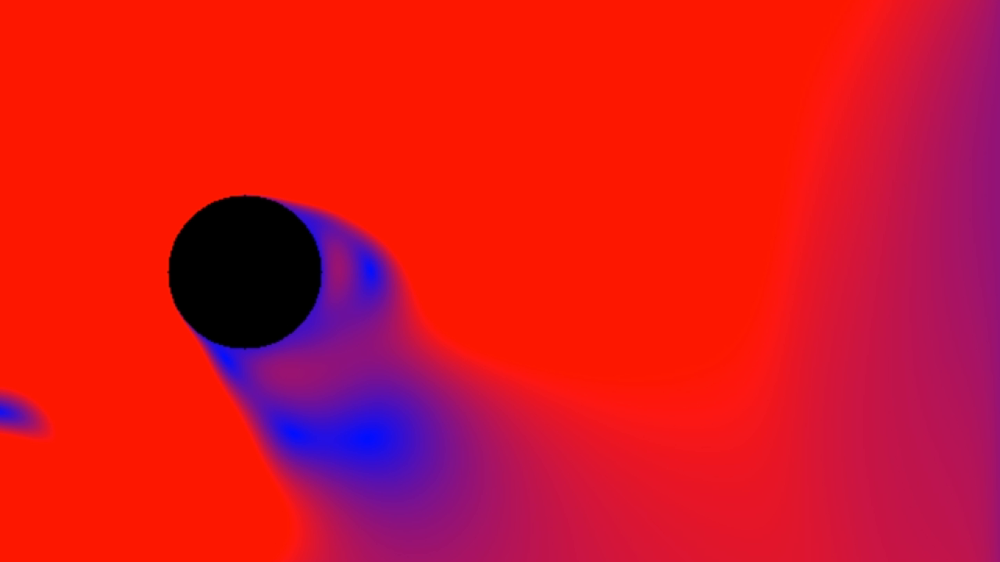
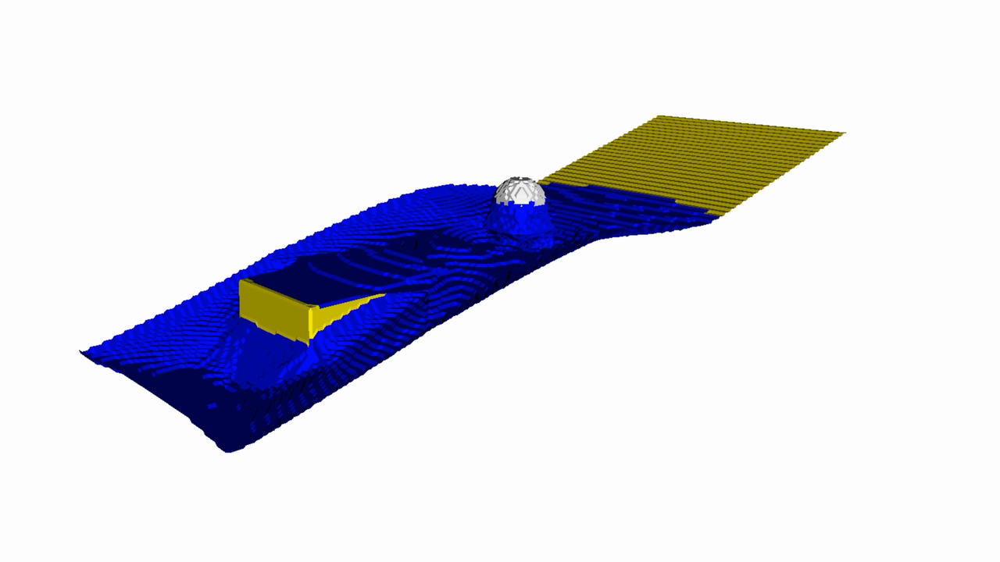
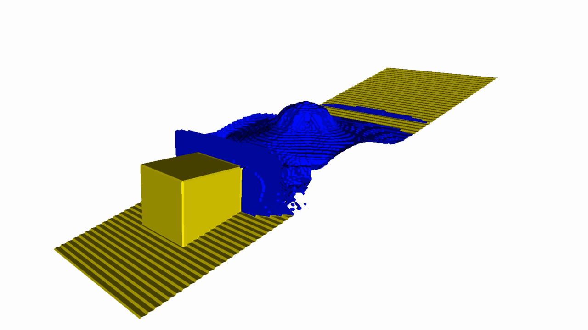
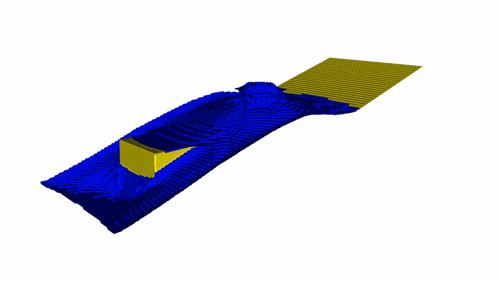
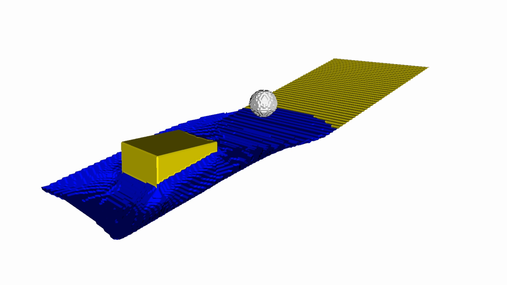
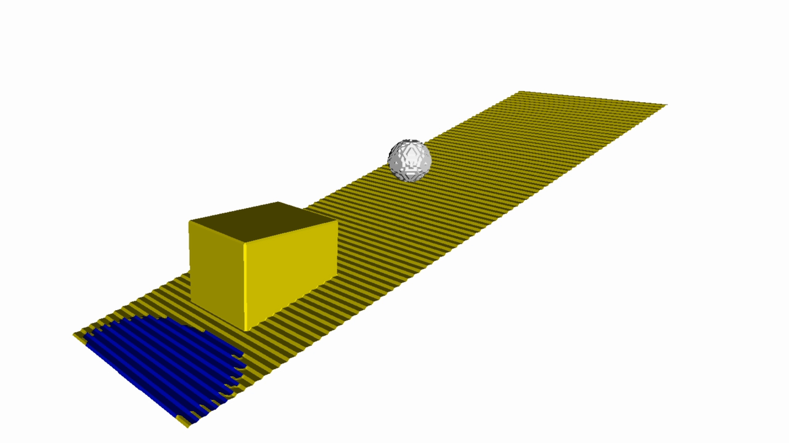

# GPU Fluid Simulation with Lattice Boltzmann and Marching Cubes

A GPU-based research prototype for real-time fluid simulation and visualization. The project was developed as part of Maximilian Heß's Bachelor's thesis in the Visual Computing program at Coburg University of Applied Sciences.

The application combines a Lattice Boltzmann Method (LBM) simulation implemented with Direct3D 12 compute shaders and fully GPU-based isosurface reconstruction using Marching Cubes in a mesh shader. Simulation data and generated geometry remain on the GPU, avoiding CPU transfers of dynamic mesh data.


> **Status:** Academic research prototype for Windows and DirectX 12. The main application is `V3MarchingCubes`.

## Contents

- [Research objective](#research-objective)
- [Features](#features)
- [Results](#results)
- [Gallery](#gallery)
- [Main application](#main-application)
- [Technical overview](#technical-overview)
- [Requirements](#requirements)
- [Build](#build)
- [Running the application](#running-the-application)
- [Controls](#controls)
- [Project structure](#project-structure)
- [Documentation](#documentation)
- [Known limitations](#known-limitations)
- [Citation and license](#citation-and-license)

## Research objective

The thesis investigates how modern GPU features can support a tightly coupled fluid simulation and visualization pipeline. Its main areas of focus are:

- LBM compute shaders with SRV/UAV-based data management
- a D3Q19 simulation with collision, streaming, and dynamic cell types
- Marching Cubes surface generation directly in a mesh shader
- minimal CPU-GPU data transfers
- measurable evaluation of runtime, throughput, memory use, and generated geometry

GPU Work Graphs are **not** part of the current implementation. The thesis discusses them as a possible future extension for adaptive work dispatching.

## Features

- 2D LBM with a D2Q9 lattice, validated with a Kármán vortex street
- 3D LBM with a D3Q19 lattice
- BGK relaxation and the Guo forcing scheme
- inflow, outflow, wall, and obstacle boundary conditions
- dynamic Empty, Interface, and Fluid cell types
- collision, streaming, and cell-type update passes implemented as HLSL compute shaders
- ping-pong buffers without CPU-side simulation data copies
- Marching Cubes implemented as a mesh shader with edge and triangle lookup tables
- glTF scene import through Assimp
- interactive configuration and debug slices with Dear ImGui
- GPU timestamps, MLUPS, VRAM usage, and triangle statistics
- additional rendering experiments including depth of field, fog, and post-processing

## Results

The benchmarks documented in the thesis were recorded from a release build on an NVIDIA RTX 3090 with driver version 581.29. The tested lattice resolutions range from 94³ to 320³ cells.

| Resolution | GPU frame time | MLUPS | FPS | VRAM | Triangles avg. / max. |
| ---: | ---: | ---: | ---: | ---: | ---: |
| 94³ | 3.1 ms | 587 | 420 | 0.42 GiB | 0.076 / 0.122 million |
| 128³ | 8.3 ms | 642 | 170 | 0.66 GiB | 0.121 / 0.271 million |
| 192³ | 21.1 ms | 606 | 49 | 1.61 GiB | 0.284 / 0.618 million |
| 256³ | 49.1-49.2 ms | 556 | 19 | 3.38 GiB | 0.341 / 1.038 million |
| 320³ | 97.3 ms | 588 | 9 | 6.50 GiB | 0.888 / 1.581 million |

The qualitative evaluation shows stable, coherent flow patterns with recognizable waves and vortices. Visible terracing on the surface reflects the discrete lattice resolution. Unsuitable boundary conditions or relaxation parameters can produce oscillating isosurfaces and fragmentation.

## Gallery

| 2D validation | 3D surface reconstruction |
| :---: | :---: |
|  |  |
| D2Q9 flow field used to examine a Kármán vortex street | D3Q19 simulation with a Marching Cubes isosurface generated at runtime |

### Marching Cubes gallery

The following images show different states of the isosurface reconstructed in the mesh shader. The visible contour lines result from sampling the discrete D3Q19 lattice and reveal the evolving surface and its interaction with the obstacles.

| Early simulation state | Expanded isosurface |
| :---: | :---: |
|  |  |
| **Interaction with sphere and box** | **Later simulation state** |
|  |  |

## Main application

`V3MarchingCubes` is the sole application target in this publication repository. It combines the 3D LBM simulation, dynamic cell types, free-surface reconstruction with Marching Cubes, debug visualization, and performance metrics.

## Technical overview

During each simulation iteration, the GPU processes collision, streaming, and cell-type updates in sequence. Two structured lattice buffers exchange their roles between the compute passes. The Marching Cubes mesh shader then reads the current state and emits the visible isosurface directly into the rasterization pipeline.

```text
CPU / ImGui configuration
          |
          v
LBM collision (compute shader)
          |
          v
LBM streaming (compute shader)
          |
          v
Cell-type update (compute shader)
          |
          v
Marching Cubes (mesh shader)
          |
          v
Rasterization + scene + post-processing
```

See [docs/ARCHITECTURE.md](docs/ARCHITECTURE.md) for a detailed description.

## Requirements

- 64-bit Windows 10 or Windows 11
- DirectX 12-capable GPU with a current driver
- Mesh Shader Tier 1 support for `V3MarchingCubes`
- Visual Studio 2022 with the **Desktop development with C++** workload, or a compatible MSVC developer shell
- CMake 3.21 or newer
- Ninja
- Git
- [vcpkg](https://github.com/microsoft/vcpkg) with the `VCPKG_ROOT` environment variable set
- internet access during the initial configuration

The `glm`, `imgui`, and `assimp` dependencies are declared in `vcpkg.json`. CMake also downloads the DirectX Agility SDK (`Microsoft.Direct3D.D3D12` 1.613.3) and DXC (`Microsoft.Direct3D.DXC` 1.8.2403.18) as NuGet packages.

## Build

Run all commands from the repository root.

### 1. Clone the repository

```powershell
git clone https://github.com/MacRosefield/d3d12-lbm-fluid-simulation.git
cd d3d12-lbm-fluid-simulation
```

### 2. Prepare vcpkg

If vcpkg is not already installed:

```powershell
$vcpkgDir = Join-Path $env:USERPROFILE "source\vcpkg"
git clone https://github.com/microsoft/vcpkg.git $vcpkgDir
& "$vcpkgDir\bootstrap-vcpkg.bat"
$env:VCPKG_ROOT = $vcpkgDir
```

### 3. Configure and build

```powershell
cmake --preset windows-msvc-release-developer-mode `
  -DCMAKE_TOOLCHAIN_FILE="$env:VCPKG_ROOT\scripts\buildsystems\vcpkg.cmake"

cmake --build out/build/windows-msvc-release-developer-mode `
  --target V3MarchingCubes
```

Use the `windows-msvc-debug-developer-mode` preset for a debug build. Additional presets are defined in `CMakePresets.json`.

## Running the application

The applications use relative paths to the assets under `data/`. Start the main application from its generated binary directory:

```powershell
cd out/build/windows-msvc-release-developer-mode/bin
.\V3MarchingCubes.exe
```

Depending on the generator, the executable may be located in an additional configuration directory such as `RelWithDebInfo/`.

The default scene is selected in `Assignments/V3MarchingCubes/src/main.cpp`. The repository includes the `NobleCraftsman`, `sponza_scene`, and `ww2_cityscene_-_carentan_inspired` assets under `data/`.

## Controls

The ImGui interface contains three primary sections:

- **Information:** frame rate, camera position, and statistics for the loaded scene
- **Configuration:** LBM parameters, lattice dimensions, debug slices, lighting, and camera settings
- **GPU Timings:** simulation stage timings, MLUPS, VRAM usage, and generated triangle counts

| Setting | Effect |
| --- | --- |
| `Active Simulation` | starts or pauses the 3D simulation |
| `Display MESH` | shows or hides the Marching Cubes surface |
| `Simulation step per Frame` | controls the number of simulation iterations per frame |
| `Inflow speed` / `Outflow speed` | controls the flow-domain boundary conditions |
| `LBM Tau` | controls the LBM relaxation time |
| `Size - X/Y/Z` | controls the dimensions of the simulation lattice |
| `Display Debug Planes` | shows a slice through the 3D lattice |
| `View LBM ...` | visualizes cell type, density, mass, or fill fraction |

Lattice dimension changes take effect after selecting `Accept changes`, which recreates the associated GPU resources.

## Project structure

```text
.
|-- Assignments/
|   `-- V3MarchingCubes/       # Main application
|       |-- include/           # Headers and GPU data structures
|       |-- shaders/           # Compute, mesh, vertex, and pixel shaders
|       `-- src/               # Application and D3D12 resource management
|-- data/                      # glTF scenes and textures
|-- docs/                      # Technical documentation
|-- gimslib/                   # Embedded DirectX 12 application framework
|-- CMakeLists.txt
|-- CMakePresets.json
`-- vcpkg.json
```

## Documentation

- [Architecture and data flow](docs/ARCHITECTURE.md)
- [Methodological background](docs/THEORY.md)
- [Troubleshooting](docs/TROUBLESHOOTING.md)
- Bachelor's thesis: *Simulation und Visualisierung von Fluiden mit neuartigen GPUs*, Maximilian Heß, Coburg University of Applied Sciences, 2025

## Known limitations

- The implementation is specific to Windows and DirectX 12.
- The scene path and debug mode are currently hard-coded in each application's `main.cpp`.
- Some shaders and simulation parameters are experimental and tuned for the included scenes.
- Numerical stability depends strongly on the selected boundary conditions and relaxation time.
- The repository contains no automated numerical validation tests.
- This project is a research prototype, not a production-ready fluid engine.

## Citation and license

GitHub can export the metadata from `CITATION.cff` through **Cite this repository**. Recommended citation:

```text
Heß, Maximilian: Simulation und Visualisierung von Fluiden mit neuartigen GPUs.
Bachelor's thesis, Coburg University of Applied Sciences,
Faculty of Electrical Engineering and Computer Science, Visual Computing, 2025.
```

Licenses for the included models and textures are stored alongside their respective files under `data/`. The repository currently has no project-wide license for its source code. Without an additional license, standard copyright restrictions apply; contact the author before reusing the code.
