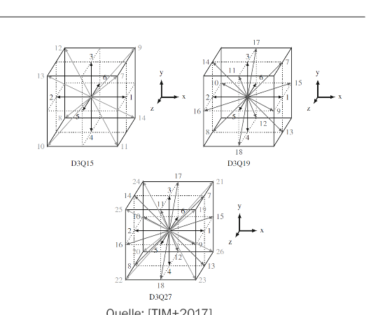
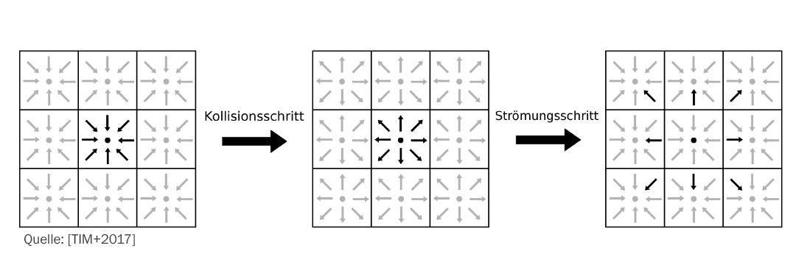
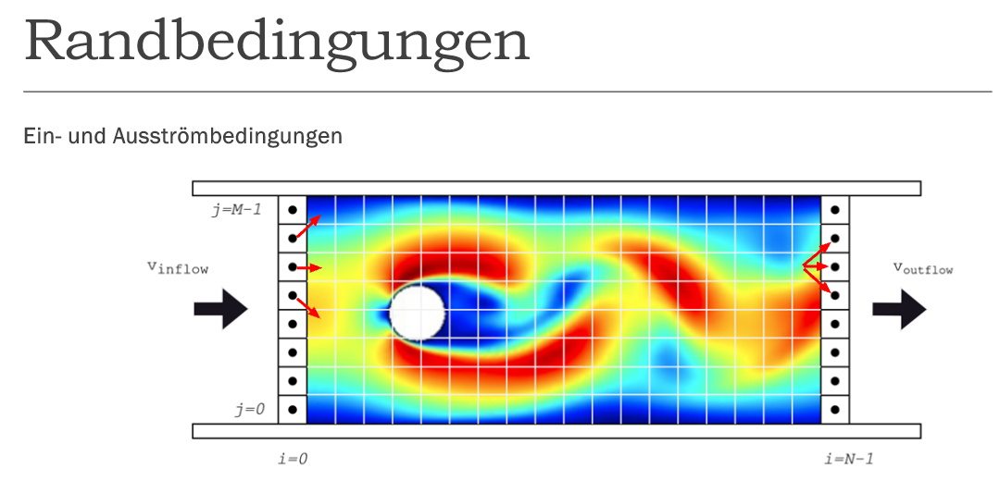
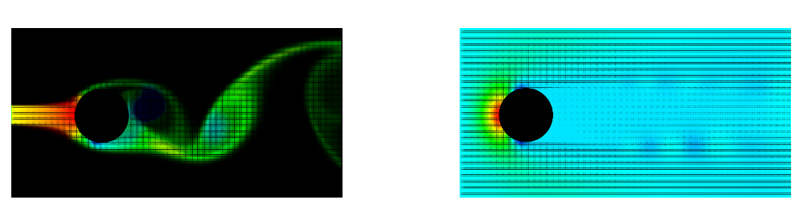

# Methodische Grundlagen

Diese Seite fasst die theoretischen Grundlagen aus der begleitenden Präsentation und der Bachelorarbeit zusammen. Sie ordnet die im Projekt verwendeten Datenstrukturen und Shader-Passes fachlich ein.

## Einordnung der Lattice-Boltzmann-Methode

Strömungen lassen sich auf unterschiedlichen Skalen beschreiben:

| Skala | Betrachtung | Typisches Modell |
| --- | --- | --- |
| mikroskopisch | einzelne Teilchen und deren Wechselwirkungen | Molekulardynamik, Newtonsche Mechanik |
| mesoskopisch | statistische Verteilung von Teilchenensembles | Boltzmann-Gleichung und LBM |
| makroskopisch | direkt beobachtbare Größen wie Druck und Geschwindigkeit | Navier-Stokes-Gleichungen |

Die Lattice-Boltzmann-Methode arbeitet auf der mesoskopischen Ebene. Ein Gitterknoten repräsentiert kein einzelnes Teilchen, sondern eine lokale Teilchenverteilung. Aus den Verteilungsfunktionen werden makroskopische Größen wie Dichte und Geschwindigkeit rekonstruiert. Die lokalen Operationen und regelmäßigen Speicherzugriffe lassen sich gut auf viele GPU-Threads verteilen.

## DQ-Modelle

Die Bezeichnung `DdQq` beschreibt ein diskretes Geschwindigkeitsmodell:

- `d` gibt die Anzahl der räumlichen Dimensionen an.
- `q` gibt die Anzahl der diskreten Geschwindigkeitsrichtungen an.

Die 2D-Validierung dieses Projekts verwendet D2Q9. Die Hauptsimulation nutzt D3Q19 und speichert deshalb pro Gitterzelle 19 Verteilungsfunktionen.

*Vergleich dreidimensionaler DQ-Modelle. Quelle der Darstellung: Krüger et al. (2017), übernommen aus der begleitenden Präsentation.*

## Collision und Streaming

Eine LBM-Iteration besteht aus zwei zentralen Phasen:

1. **Collision:** Die lokalen Verteilungsfunktionen relaxieren in Richtung einer Gleichgewichtsverteilung. Im Projekt geschieht dies mit dem BGK-Operator. Der Guo-Kraftterm ergänzt die Wirkung der Schwerkraft.
2. **Streaming:** Die aktualisierten Verteilungen wandern entlang ihrer diskreten Geschwindigkeitsrichtungen zu den benachbarten Gitterzellen.

*Schematischer Ablauf von Collision und Streaming. Quelle der Darstellung: Krüger et al. (2017), übernommen aus der begleitenden Präsentation.*

In der GPU-Implementierung arbeiten beide Schritte auf zwei strukturierten Puffern. Collision liest den aktuellen Zustand und schreibt in den zweiten Puffer. Streaming bindet die Puffer anschließend in vertauschter Richtung. UAV-Barriers sichern die Sichtbarkeit der Ergebnisse zwischen den Dispatches.

## Ablauf einer Simulationsiteration

Der fachliche Ablauf lässt sich auf folgende Schritte reduzieren:

1. Verteilungsfunktionen initialisieren
2. Dichte und Geschwindigkeit aus den Verteilungen bestimmen
3. Gleichgewichtsverteilung berechnen
4. Collision mit Relaxation und Kräften ausführen
5. Verteilungen in die Nachbarzellen streamen
6. Randbedingungen anwenden
7. Zelltypen anhand von Masse und Füllgrad aktualisieren
8. nächsten Zeitschritt beginnen

Die konkrete Anwendung ergänzt nach den Compute-Passes die Marching-Cubes-Auswertung und das Rendering der erzeugten Isofläche.

## Randbedingungen

Randbedingungen legen fest, wie Verteilungen an Wänden, Hindernissen sowie Ein- und Ausströmflächen behandelt werden.

- **Bounce-back / No-slip:** Gegen eine feste Wand laufende Verteilungen werden in die Gegenrichtung reflektiert. Die Geschwindigkeit an der Wand entspricht null.
- **Inflow:** Vorgegebene Dichte- und Geschwindigkeitswerte speisen Fluid in die Simulationsdomäne ein.
- **Outflow:** Verteilungen verlassen die Domäne, ohne an der Grenze zurückgeworfen zu werden.
- **Obstacle und Wall:** Zellen bilden feste Geometrie ab und nehmen nicht an der normalen Fluidaktualisierung teil.

*Prinzipdarstellung der Ein- und Ausströmrandbedingungen aus der begleitenden Präsentation.*

## Visualisierung physikalischer Größen

Vor der dreidimensionalen Marching-Cubes-Darstellung wurden unterschiedliche 2D-Visualisierungen verwendet, um die LBM zu kontrollieren. Dazu gehören Farbkarten für skalare Größen und Vektorfelder für die Strömungsrichtung.

*Beispiele einer skalaren Feldansicht und eines Geschwindigkeitsfelds aus der begleitenden Präsentation.*

Die Hauptanwendung führt dieses Prinzip in drei Dimensionen fort. Dichte, Masse, Füllgrad und Zelltyp können auf einer Debug-Schnittebene betrachtet werden. Für die sichtbare Oberfläche wertet Marching Cubes das skalare Feld im gesamten 3D-Gitter aus.

## Literaturhinweis

Die in zwei Abbildungen mit `[TIM+2017]` gekennzeichnete Quelle ist:

> Timm Krüger, Halim Kusumaatmaja, Alexandr Kuzmin, Orest Shardt, Gonçalo Silva und Erlend Magnus Viggen: *The Lattice Boltzmann Method: Principles and Practice*. Springer International Publishing, 2017.

Vor einer öffentlichen Weitergabe sollten die Nutzungsrechte aller aus Präsentationsquellen übernommenen Abbildungen abschließend geprüft werden.
